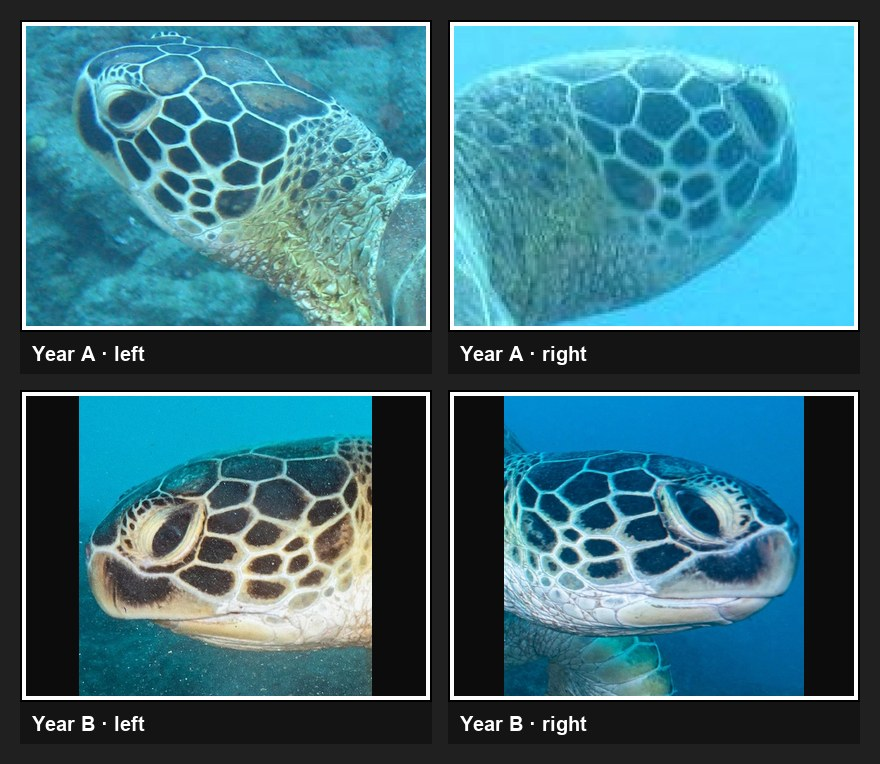
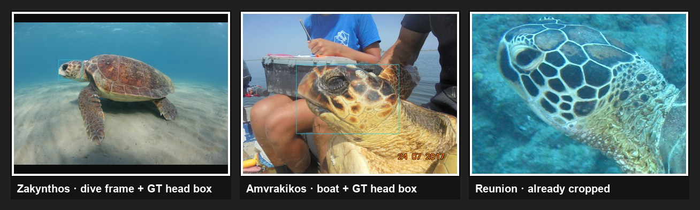
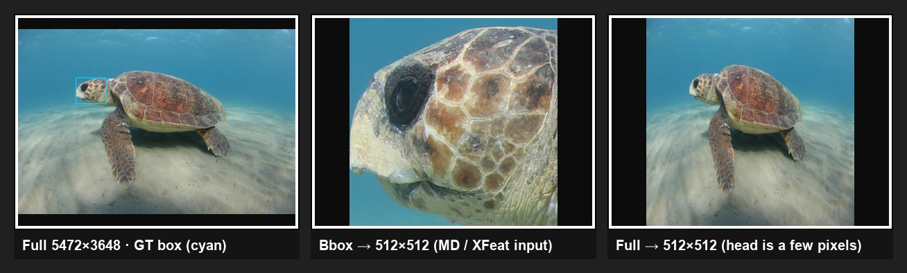
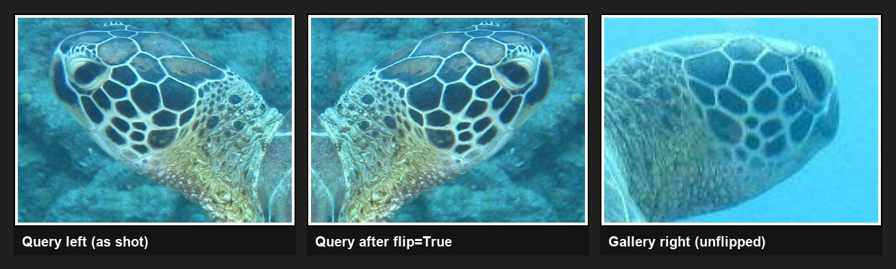
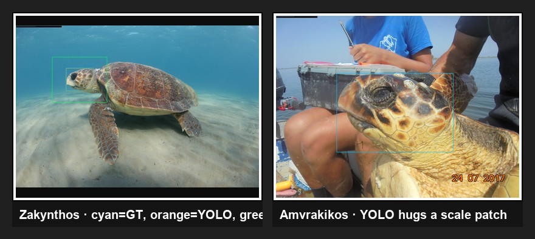

# Current best method

**A CalShortlist** — MegaDescriptor shortlist → XFeat match counts → isotonic+PCHIP calibration → fused rerank.

This is the best identification recipe in this repo as of 13 Aug 2026.  
How calibration works: [md-xfeat-calibration.md](md-xfeat-calibration.md).

## Methodology

Closed-set sea turtle re-identification: given a query profile photo, rank a gallery of other photos and report whether the true identity is in top-1 / top-5. Nothing is fine-tuned on turtle images. **MegaDescriptor-L-384** and **XFeat** stay frozen. The only learned piece is an **isotonic + PCHIP** calibrator that maps each raw score to an estimated P(same identity).

The four galleries are the public Wildlife Datasets packs built for the opposite-profile paper ([Adam et al., 2024](https://www.biorxiv.org/content/10.1101/2024.09.13.612839)). How they were collected and labelled is below; how this repo *uses* them starts at Protocol.

### Dataset building

The packs are **structured photo-ID galleries**, not a dump of every field photo. Every identity is required to have the same four-photo layout so left/right and same-year/different-year comparisons are balanced.

```
per identity
  year A:  left profile + right profile
  year B:  left profile + right profile
```

That design is deliberate. Matching two photos from the same encounter can cheat on background or lighting. Two years apart, those cues change; a hit has to come from head-scale geometry, colour, and pigmentation. A hand-drawn **head bounding box** is applied on wide scenes so the matcher never sees the boat, sand, or water.



*Figure 1. Four-photo layout for one identity: left and right in year A, left and right in year B. Reunion Green “Song” — files are already head crops.*

**What was labelled (every image)**

| Field | Meaning |
|---|---|
| Identity | Known turtle from the field photo-ID catalogue (not assigned by this repo) |
| Orientation | `left` / `right` head profile (`top` exists on Amvrakikos and is dropped) |
| Date / year | Capture time; used to pick the two-year pair |
| Head bbox | Axis-aligned rectangle around the head (`bbox_x, bbox_y, bbox_width, bbox_height`) when the file is a full scene |

**How each pack was collected**

| Pack | Site / species | Capture | Why it looks like this |
|---|---|---|---|
| **Zakynthos** | Laganas Bay, Greece. Loggerhead (*Caretta caretta*). 2018–2024. | Underwater snorkeling, one photographer (KP). Canon 6D (5472×3648) + fisheye, 1–8 m depth. | Full dive frames; the head is a small patch. Identities are **new** turtles, not in SeaTurtleID2022 (MegaDescriptor’s turtle training set). Catalogue: `annotations.csv` (identity, path, orientation, date) merged with `bbox.csv` (`label_name=head`). |
| **Amvrakikos** | Amvrakikos Gulf, Greece. Loggerhead. Summers 2014–2022. | ARCHELON capture–mark–recapture. Turtle taken onto the boat (rodeo); head sides photographed in sun or shade. Mixed cameras. | Boat scenes; the head fills much of the frame. Filename `{id}_{year}_{left\|right\|top}_…`. Wildlife keeps left/right only (drops `top`). Bbox is in `annotations.csv` (`label_name=Head`). |
| **Reunion Green / Hawksbill** | Réunion Island. Green (*Chelonia mydas*, 50 IDs) and hawksbill (*Eretmochelys imbricata*, 34 IDs). 2007–2024. | Citizen-science divers, no fixed distance or angle. Stored in TORSOOI. | Files are **already head-profile crops** (~800×600). No bbox column. Split on `species`. Orientation from the filename (`L`/`R`). Optional TORSOOI scale codes exist but are not used here. |



*Figure 2. Crop rule. Cyan = dataset head box. Zakynthos and Amvrakikos are full scenes; Reunion is already a head shot.*

**Counts after catalogue construction** (Wildlife `img_load='auto'`): 40×4 Zakynthos, 50×4 Amvrakikos, 50×4 Green, 34×4 Hawksbill. This repo then keeps only **bilateral** identities (already true by construction) and, for calibration, holds out 1 left + 1 right per identity.

Public sources: [ZakynthosTurtles](https://www.kaggle.com/datasets/wildlifedatasets/zakynthosturtles), [AmvrakikosTurtles](https://www.kaggle.com/datasets/wildlifedatasets/amvrakikosturtles), [ReunionTurtles](https://www.kaggle.com/datasets/wildlifedatasets/reunionturtles). Loaders: `wildlife_datasets` via `sides_matching/datasets.py`.

### Datasets (as used here)

| Dataset | Species | Photos | Identities | Image type | Head crop |
|---|---|---:|---:|---|---|
| ReunionHawksbill | Hawksbill | 136 | 34 | ~800×600 head shots | Already cropped (no bbox column) |
| ReunionGreen | Green | 200 | 50 | ~800×600 head shots | Already cropped |
| Zakynthos | Loggerhead | 160 | 40 | 5472×3648 dive photos | Hand-drawn bbox (`bbox.csv`) |
| Amvrakikos | Loggerhead | 200 | 50 | Boat photos | Hand-drawn bbox (`annotations.csv`) |

Only **bilateral** identities are kept (at least one left and one right photo). Unilateral identities and unknown orientations (e.g. Amvrakikos top shots) are dropped before the split.

### Protocol

1. **Query flip.** The query is horizontally mirrored (`flip=True`); the gallery is not. This is the opposite-profile protocol from the paper.
2. **Calibration / test split** (`one_per_side`, `seed=0`). For every identity, hold out **1 left + 1 right** photo to fit the calibrator. Every remaining photo is a test query. Gallery for a test query still contains all kept photos (including that turtle’s calibration photos). Test queries never enter the calibrator fit.
3. **Features.** MegaDescriptor embeddings come from Wildlife pickles (`img_load='auto'`): bbox if present, otherwise full image. XFeat uses the **same rule**, then square-resize to 512×512 (`--bbox-crop`).
4. **Shortlist.** Per query, take the top \(N = \mathrm{round}(0.4\,n)\) gallery images by MD cosine (\(n\) = gallery size). XFeat match counts are computed only on those \(N\) pairs.
5. **Rerank (A CalShortlist).** Fit isotonic + PCHIP independently on MD cosines and on XFeat counts using calibration queries. On the shortlist, rank by
   \[
   f_{ij} = \tfrac12\bigl(\hat p_{\mathrm{MD}}(s^{\mathrm{MD}}_{ij}) + \hat p_{\mathrm{XFeat}}(s^{\mathrm{XF}}_{ij})\bigr)
   \]
   with raw MD cosine as tie-break. Candidates outside the shortlist keep MD order.

Self-matches are blocked (diagonal ignored). **Full top-1 / top-5** count a hit if the true identity appears in the top-\(k\) unique identities. **Opp. top-1** ignores same-side same-identity gallery hits.

### Baselines

The same test queries are scored three ways:

| Method | Ranking key |
|---|---|
| MegaDescriptor | Raw MD cosine on the full gallery |
| XFeat | Raw match counts on the MD top-\(N\) (512×512, same crop as MD) |
| **A CalShortlist** | Equal average of calibrated MD and calibrated XFeat on the MD top-\(N\) |

### Preprocessing rule

**Bbox if the dataset has one, otherwise full image.** MD and XFeat always see the same region, then XFeat square-resizes to 512×512. No mixing (MD cropped, XFeat full-frame).

- **Zakynthos / Amvrakikos** — `--bbox-crop` using the dataset head box (`bbox_x, bbox_y, bbox_width, bbox_height`).
- **Reunion Green / Hawksbill** — no bbox column; files are already head shots. Full image → 512×512.

YOLO is not part of this method yet. Off-the-shelf `yolo_kepala/kepala.pt` boxes a tight scale patch, not the Wildlife head rectangle, so it cannot replace `--bbox-crop`. **Train a YOLO detector on the dataset bboxes** (Zakynthos `bbox.csv`, Amvrakikos `annotations.csv`) so production photos without a hand-drawn box still get the same crop MD and XFeat expect.

## Recipe

```
Query (flip=True)
    │
    ▼
MegaDescriptor cosine  ──►  top-N gallery (N ≈ 40% of gallery size)
    │
    ▼
XFeat match counts on those N pairs  (bbox if present else full, then 512×512)
    │
    ▼
Isotonic + PCHIP:  MD cosine → p̂_MD
                   XFeat count → p̂_XFeat
    │
    ▼
score = 0.5 · (p̂_MD + p̂_XFeat)
    │
    ▼
Rerank shortlist  (MD cosine breaks remaining ties)
```

### Settings that matter

| Knob | Value | Why |
|---|---|---|
| Query protocol | `flip=True` | Local matching needs the query mirrored. ReunionGreen XFeat N=10: 26.0% unflipped vs 75.5% flipped. |
| Shortlist size | **N = 40% of gallery** (`--shortlist-fraction 0.4`) | Beats N=10 on the same split: Green 71.0% → 74.0%, Hawksbill 79.4% → 83.8%. |
| MD input | Wildlife pickle (`img_load='auto'`) | Bbox crop on Zakynthos / Amvrakikos; full image on Reunion (already head shots). |
| XFeat input | **Bbox if present, else full**, then 512×512 | Zakynthos head is median **2.05%** of the 5472×3648 frame. Full-frame XFeat 25.0%; bbox XFeat 47.5%. |
| Calibration split | 1 left + 1 right per identity (`seed=0`) | Remaining images are the test queries. Bilateral identities only. |
| Fusion | Equal average of calibrated probabilities | Cal > max(MD, XFeat) on all four datasets. Raw XFeat would drop Zakynthos 71.2% → 47.5%. |
| Detector | **Off until retrained** | `kepala.pt` drops Zakynthos MD 71.2% → 26.3%. Train YOLO on dataset boxes before using it as a crop. |

## Best observed test top-1

Protocol: `flip=True`, bilateral identities, `one_per_side` calibration, remaining images as queries.  
**A CalShortlist**, N = 40% of gallery.

| Dataset | Crop | N | Queries | MD | XFeat | **A CalShortlist** |
|---|---|---:|---:|---:|---:|---:|
| ReunionHawksbill | full (head shots) | 54 | 68 | 60.3% | 76.5% | **83.8%** |
| ReunionGreen | full (head shots) | 80 | 100 | 57.0% | 67.0% | **74.0%** |
| Zakynthos | bbox | 64 | 80 | 71.2% | 47.5% | **73.7%** |
| Amvrakikos | bbox | 80 | 100 | 51.0% | 61.0% | **66.0%** |

CSV: [md_xfeat_cal_shortlist_N40pct_bbox.csv](results/md_xfeat_cal_shortlist_N40pct_bbox.csv)

**Recommended default for a new dataset:** CalShortlist, N=40% of gallery, bbox if the dataset has one otherwise full image, `flip=True`. For photos without a box, train YOLO on the existing head bboxes rather than using `kepala.pt`.

## Why these decisions work

Same protocol as the table unless noted: `flip=True`, `one_per_side`, test queries only.

### 1. Fused rerank beats either stream alone

MD cosine and XFeat counts are not on the same scale. Isotonic+PCHIP maps each to P(same identity); averaging lets a strong local match pull a mid-ranked MD candidate up without letting a weak match count overwrite a high MD cosine.

| Dataset | Better base | CalShortlist | Lift vs better base |
|---|---|---:|---:|
| ReunionHawksbill | XFeat 76.5% | **83.8%** | **+7.3 pp** |
| ReunionGreen | XFeat 67.0% | **74.0%** | **+7.0 pp** |
| Amvrakikos | XFeat 61.0% | **66.0%** | **+5.0 pp** |
| Zakynthos | MD 71.2% | **73.7%** | **+2.5 pp** |

On Zakynthos XFeat (47.5%) is *worse* than MD. Ranking by XFeat counts would lose **23.7 pp**. Fusion still gains +2.5 pp over MD because the calibrator down-weights noisy match counts. That is the proof that the average of calibrated probabilities is the right combine rule.

### 2. Bbox if present, otherwise full

Zakynthos GT head boxes occupy **0.07–12.0%** of the raw photo (median **2.05%**, n=160). Resize the full 5472×3648 frame to 512×512 and the head is a few pixels; XFeat keypoints land on sand/water.



*Figure 3. Same Zakynthos photo. Left: full camera frame with GT box. Middle: that box resized to 512×512. Right: the whole frame squashed to 512×512.*

| Zakynthos N=64, 80 test queries | XFeat top-1 | CalShortlist |
|---|---:|---:|
| Full-frame XFeat (MD still bbox from pickle) | 25.0% | 71.2% (= MD; XFeat adds nothing) |
| **`--bbox-crop` on XFeat** | **47.5%** | **73.7%** |

CSV: [zakynthos_md_xfeat_cal_shortlist_N40pct_full.csv](results/zakynthos_md_xfeat_cal_shortlist_N40pct_full.csv) vs [N40pct_bbox](results/md_xfeat_cal_shortlist_N40pct_bbox.csv).

Reunion has **no bbox** and the files are already ~800×600 head shots, so full image is the correct crop. Forcing `kepala.pt` on those heads *hurts* (Green Cal 74.0% → 69.0%, Hawksbill 83.8% → 76.5%). Amvrakikos heads are already large (median **33.7%** of the boat photo); the dataset box is still the labelled region both models should use.

### 3. `flip=True`

Opposite-profile matching: a left query must be mirrored so its scale pattern can overlap a right gallery photo. MegaDescriptor is fairly flip-invariant; XFeat is not.



*Figure 4. `flip=True` mirrors the query so a left profile can overlap a right gallery photo for XFeat.*

Fact from the N-sweep (all queries, ReunionGreen MD→XFeat N=10): **26.0%** with `flip=False` vs **75.5%** with `flip=True`. Hawksbill N=10: **36.8%** vs **78.7%**. CSV: [md_xfeat_n_sweep.csv](results/md_xfeat_n_sweep.csv).

### 4. N = 40% of gallery, not N=10

XFeat only sees the MD shortlist. If the true match is outside N, fusion cannot recover it. On the same bilateral split, raising N from 10 to 40% of gallery:

| Dataset | Cal N=10 | Cal N=40% | Lift |
|---|---:|---:|---:|
| ReunionGreen | 71.0% | **74.0%** | +3.0 pp |
| ReunionHawksbill | 79.4% | **83.8%** | +4.4 pp |

CSV: [N10 Green](results/reunion_md_xfeat_cal_shortlist_N10.csv) · [N10 Hawksbill](results/reunion_hawksbill_md_xfeat_cal_shortlist_N10.csv).

### 5. Current `kepala.pt` is the wrong box

It detects a tight scale patch, not the Wildlife head rectangle. Using it as a crop (and recomputing MD from raw PIL) collapses the MD pickle advantage:



*Figure 5. `kepala.pt` vs the dataset box. Cyan = GT head, orange = YOLO, green = padded crop. YOLO boxes a scale patch, not the head.*

| Dataset | MD (dataset crop) | MD (`kepala.pt`) | Cal (dataset crop) | Cal (`kepala.pt`) |
|---|---:|---:|---:|---:|
| Zakynthos | 71.2% | **26.3%** | 73.7% | 22.5% |
| Amvrakikos | 51.0% | 32.0% | 66.0% | 53.0% |
| ReunionGreen | 57.0% | 51.0% | 74.0% | 69.0% |
| ReunionHawksbill | 60.3% | 55.9% | 83.8% | 76.5% |

CSV: [kepala N40%](results/md_xfeat_cal_shortlist_N40pct_kepala.csv) · [Zakynthos kepala min10](results/zakynthos_md_xfeat_cal_shortlist_N40pct_kepala_min10.csv).

That is why the detector stays off until it is **trained on the dataset bboxes**.

## Conclusion

Calibrated shortlist fusion is the method to use. The facts above are why: fusion is strictly above both bases on all four datasets; bbox crop is what makes XFeat informative on dive photos; `flip=True` and N=40% are the settings that move the number; `kepala.pt` is not a substitute for the labelled head box.

For a new dataset: freeze MD and XFeat, crop both to the dataset bbox when it exists (or a YOLO trained to predict that box), shortlist 40% of the gallery, calibrate on 1 left + 1 right per identity, and rank by the average of the two calibrated probabilities.

## Reproduce

```bash
.venv/bin/python scripts/compare_md_xfeat_cal_shortlist.py \
  --datasets Amvrakikos ReunionGreen ReunionHawksbill Zakynthos \
  --shortlist-fraction 0.4 \
  --bbox-crop \
  --cache-dir /tmp/xfeat_bbox_compare \
  --out docs/results/md_xfeat_cal_shortlist_N40pct_bbox.csv
```

`--bbox-crop` is a no-op on Reunion (no bbox column).

## Do not use

| Approach | What happens |
|---|---|
| XFeat on uncropped dive photos | Head occupies ~1% of a 512×512 squash. Match counts become noise (Zakynthos 25%). |
| `--yolo-kepala` with current `kepala.pt` | Boxes a scale patch, not the dataset head rectangle. Train YOLO on GT bboxes first. |
| Identities with only one side | Excluded from this protocol. Calibration needs 1L+1R held out. |

## Code map

| Piece | Where |
|---|---|
| Benchmark | `scripts/compare_md_xfeat_cal_shortlist.py` |
| MD embeddings | `sides_matching/megadescriptor_matching.py` (precomputed pickles) |
| XFeat + `--bbox-crop` | `sides_matching/xfeat_matching.py` |
| Fusion / metrics | `sides_matching/evaluation.py` |
| GT boxes | `data/ZakynthosTurtles/bbox.csv`, `data/AmvrakikosTurtles/annotations.csv` |
