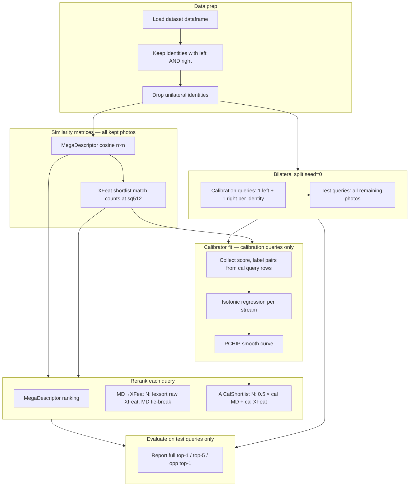

# MD→XFeat and calibrated shortlist fusion

How **MegaDescriptor → XFeat** shortlist reranking works, what **isotonic + PCHIP** calibration means, and how **A CalShortlist** differs from a naive cascade.

Script: `[scripts/compare_md_xfeat_cal_shortlist.py](../scripts/compare_md_xfeat_cal_shortlist.py)`  
Results: [ReunionGreen](results/reunion_md_xfeat_cal_shortlist_N10.csv) · [ReunionHawksbill](results/reunion_hawksbill_md_xfeat_cal_shortlist_N10.csv) · [Amvrakikos](results/amvrakikos_md_xfeat_cal_shortlist_N10.csv)

## Pipeline overview

Both methods share the same expensive stages:

1. **MegaDescriptor similarity** — cosine on global embeddings (`flip=True` query vs unflipped gallery).
2. **MD shortlist** — per query, take the top-N gallery images by MD score.
3. **XFeat features** — detect/describe keypoints at 512×512 (cached per image).
4. **XFeat shortlist matching** — match each query only against its N candidates; store raw match counts.

After step 4 they diverge in how the shortlist is reranked.

```
Query image (flipped)
       │
       ▼
 MegaDescriptor ──► top-N gallery IDs
       │
       ▼
 XFeat match counts on those N pairs
       │
       ├─► Naive cascade: rerank by raw XFeat count
       │
       └─► A CalShortlist: calibrate MD + XFeat, average, rerank
```

## End-to-end benchmark flow

Nothing is fine-tuned on turtle photos. **MegaDescriptor** and **XFeat** are frozen pretrained models. The only thing “learned” at runtime is the **isotonic + PCHIP calibrator** (score → hit-rate mapping), fit on calibration queries and applied before test evaluation.



**Per test query** (closed-set re-ID):

1. Query image is **horizontally flipped** (`flip=True`); gallery is unflipped.
2. Rank all gallery photos (self-match blocked on diagonal).
3. **Hit** if the true turtle identity appears in top-1 or top-5.
4. **Opp. top-1** ignores same-side same-identity gallery hits (opposite-profile emphasis).

**What is / isn't held out**

| Stage | Uses calibration photos? | Uses test photos? |
|---|---|---|
| MD / XFeat feature extract | All kept photos (cached) | All kept photos |
| Isotonic calibrator fit | Cal query rows only | No |
| Accuracy reporting | No | Test query rows only |

Gallery for a test query still contains **all** kept photos (including calibration photos of the same turtle). Test queries themselves never appear in the calibrator fit.

## What is isotonic + PCHIP?

MegaDescriptor outputs **cosine similarities** in roughly [-1, 1]. XFeat outputs **match counts** (non-negative integers). These scales are not comparable: a match count of 15 is not “half as good” as 30 in the same way cosine 0.7 relates to 0.35.

**Calibration** maps each raw score to an estimated **probability of a correct match** (or equivalently, a score on a common [0, 1] scale) so MD and XFeat can be fused.

This repo uses `wildlife_tools.similarity.calibration.IsotonicCalibration` (WildFusion-style), implemented in `sides_matching/predictions.py` via `Combined(method="calibrated")`.

### Explain like I'm 5

Imagine two toys that score how well two turtle photos match:

- **MegaDescriptor** gives a number like `0.7`
- **XFeat** gives a number like `12 matches`

Those numbers don't mean the same thing. You can't just add `0.7` and `12`.

**Isotonic regression** is like teaching the computer a fair ruler from examples:

- “This score was **high** → same turtle? **Usually yes.**”
- “This score was **low** → same turtle? **Usually no.**”

The rule it learns is simple: **bigger raw score → at least as good a match**. Like stairs that only go up, never down. Score 5 might mean “30% chance same turtle”; score 20 might mean “80% chance.”

But plain isotonic looks like **flat stairs with jumps** — two close scores (11 vs 12 matches) can sit on the **same step**, so you can't tell which is better.

**PCHIP** draws a **smooth ramp** through those steps instead:

- Still only goes up (never downhill)
- No weird bumps
- Close scores get slightly different heights → easier to pick the best turtle

Then both toys speak the same language (~0 to 1), and you can average them:

```
fused = (calibrated_MD + calibrated_XFeat) / 2
```

It's like converting apples and oranges into “how tasty out of 10” before comparing them — except here it's “how likely same turtle out of 1.”

### Step 1: Isotonic regression

Given many **(score, label)** pairs from a validation split:

- **score** — raw MD cosine or XFeat match count
- **label** — `1` if same identity, `0` if different identity

**Isotonic regression** fits a **monotone non-decreasing** function f such that higher raw scores map to higher estimated hit rates. It does not assume a parametric shape (unlike logistic regression); it only enforces “better raw score → not worse calibrated score.”

Intuition: if XFeat match counts 5, 10, 20 correspond to hit rates 0.2, 0.5, 0.7 on the validation set, the calibrator learns that mapping.

### Step 2: PCHIP interpolation

Plain isotonic regression produces a **stepwise** function (constant on intervals between training scores). Steps can tie different raw scores to the same calibrated value, which hurts **ranking** when reranking a shortlist.

**PCHIP** (Piecewise Cubic Hermite Interpolating Polynomial) builds a **smooth, strictly increasing** curve through the isotonic fit points. That gives:

- Unique calibrated values for nearby raw scores (better reranking)
- No spurious overshoot between knots (monotonicity preserved)


*Synthetic XFeat-like calibration pairs. Orange steps: plain isotonic — nearby integer counts (e.g. 11 vs 12) can land on the same flat step. Blue curve: isotonic knots passed through PCHIP + strict tie-break — close scores get distinct calibrated heights, which helps shortlist reranking.*

In code (`IsotonicCalibration`):

1. Fit `sklearn.isotonic.IsotonicRegression` on validation pairs.
2. Sample knot points from the isotonic curve.
3. Fit `scipy.interpolate.PchipInterpolator` through those knots.
4. At predict time, map any raw score through the PCHIP spline.

A tiny **strict adjustment** (`y + score * eps`) is added so ties are broken consistently for ranking.

### Step 3: Equal-weight fusion

After calibrating each stream separately:

\text{fused}(i, j) = \tfrac{1}{2}\bigl(\text{calmd}(i,j) + \text{calxfeat}(i,j)\bigr)

Only gallery index j in query i's MD top-N get finite XFeat scores; the rest stay -\infty.

## Methods compared


| Method                         | Rerank signal on shortlist                         | Calibration                 | Eval queries                                      |
| ------------------------------ | -------------------------------------------------- | --------------------------- | ------------------------------------------------- |
| **MD→XFeat N** (naive cascade) | Raw XFeat match count (MD tie-break)               | None                        | Test queries (bilateral split)                    |
| **A CalShortlist N**           | Mean of calibrated MD + calibrated XFeat           | Isotonic + PCHIP per stream | Test queries (bilateral split)                    |
| **FusionCalibrated** (full)    | Average calibrated scores on **all** gallery pairs | Same                        | Held-out test half (`val_fraction=0.5`, `seed=0`) |


**A CalShortlist** is FusionCalibrated restricted to the MD shortlist: same calibration, but XFeat is only computed for N candidates per query (cheap), not all n² pairs.

### Calibration / test split (`one_per_side`)

MD→XFeat cal shortlist benchmarks use a **bilateral per-identity split** (not a random 50% of photos):

1. **Exclude** identities that lack both a left and a right profile photo.
2. **Calibration queries**: per remaining identity, pick **one left + one right** photo (`seed=0`).
3. **Test queries**: all other photos of those identities (including unknown-orientation views such as Amvrakikos top shots — test only, never calibration).
4. Fit isotonic calibrators on calibration query rows; report accuracy on test queries only (same test set for MD, naive XFeat, and cal shortlist).

Implementation: `[filter_bilateral_df](sides_matching/evaluation.py)`, `[split_calibration_one_per_side](sides_matching/evaluation.py)` in `sides_matching/evaluation.py`.

### Naive cascade (lexsort)

For each query row i:

1. `short` = MD top-N indices, `rest` = remaining gallery in MD order.
2. Rerank `short` by `lexsort(-MD[i,short], -xfeat[i,short])`.
3. Output ranking: reranked shortlist, then `rest`.

In NumPy, `lexsort` takes keys **last → first** priority, so **XFeat is the primary key** and MD cosine is only a **tie-breaker** when two candidates have the exact same match count.

### Why lexsort cascade is weak

Lexsort is a fine *sort primitive*; the problem is using it as a **fusion rule** on two raw, incompatible signals.

**1. Lexicographic order is not fusion**

Cascade rerank sorts like a phone book: last name first, first name only when last names match. Here XFeat match count is the “last name” and MD is the “first name.” A gallery image with 12 XFeat matches always beats one with 11, even if MD strongly prefers the latter (e.g. cosine 0.82 vs 0.55). There is no way to trade off “a bit worse locally, much better globally” — the local signal always wins unless counts tie exactly.

**2. Raw scales are incomparable**

MD outputs cosine similarity (~[-1, 1]); XFeat outputs integer match counts (0, 1, 2, …). Putting them in one `lexsort` does not put them on a common ruler — it hard-codes “local first, global only on ties.” That is why calibration (isotonic + PCHIP) exists: map each stream to a comparable hit-rate scale, *then* combine.

**3. Integer ties are common**

Match counts are discrete. In a shortlist of N=10, several candidates often share the same count (especially 0 or small values). When XFeat ties, lexsort falls back to **MD order** — i.e. no effective rerank among those items. Top-1 often stays whatever MD already picked.

**4. Seen in our numbers**


| Dataset          | MD top-1 | Naive MD→XFeat | A CalShortlist | Gap (cal − naive) |
| ---------------- | -------- | -------------- | -------------- | ----------------- |
| ReunionGreen     | 57.0%    | 65.0%          | 71.0%          | +6.0 pp           |
| ReunionHawksbill | 60.3%    | 75.0%          | 79.4%          | +4.4 pp           |
| Amvrakikos       | 51.0%    | 58.0%          | 64.0%          | +6.0 pp           |


On Amvrakikos, naive cascade adds +7 pp over MD on the test split; cal shortlist adds another +6 pp by fusing calibrated scores instead of cascading raw ones.

The same pattern appears with ALIKED in [base model comparison](base-model-comparison.md): **FusionCalibrated** beats **MD→ALIKED N=30** on Reunion (74% vs 69.5% top-1 with flip).

**5. Cal shortlist still uses lexsort — on one score**

A CalShortlist reranks with `lexsort(-MD, -fused)` where `fused = 0.5 × (cal_md + cal_xfeat)` is a **single scalar on [0, 1]**. Lexsort is appropriate there: one ranking key, MD as tie-break only. The fix is not “avoid lexsort,” it is **don’t lexsort two raw streams as primary + secondary keys**.

### A CalShortlist

For each query row i:

1. Fit calibrators on **validation queries only** (not used at per-row rerank time — fit once globally).
2. `cal_md = calibrator_md(md_sim)`, `cal_xfeat = calibrator_xfeat(xfeat_sim)`.
3. On shortlist: `fused = 0.5 * (cal_md + cal_xfeat)`.
4. Rerank `short` by `lexsort(-MD[i,short], -fused[short])`, append `rest`.

Implementation: `calibrated_shortlist_fusion()` in `[scripts/compare_md_xfeat_cal_shortlist.py](../scripts/compare_md_xfeat_cal_shortlist.py)`.

## Complexity

Let n = number of images, N = shortlist size, M = cost of one XFeat image pair match.


| Stage                          | Big-O                                                                       |
| ------------------------------ | --------------------------------------------------------------------------- |
| MD similarity (precomputed)    | O(n^2)                                                                      |
| XFeat feature extract (cached) | O(n) × extract cost                                                         |
| XFeat shortlist matching       | **O(n N M)** — dominant                                                     |
| Fit isotonic+PCHIP (2 streams) | O(v \cdot n) MD pairs + O(v \cdot N) XFeat pairs, v = 2 photos × identities |
| Apply calibrators              | O(n^2) MD + O(n N) XFeat                                                    |
| Shortlist rerank               | O(n N \log N)                                                               |


Cal shortlist adds **no extra XFeat matches** vs naive cascade; overhead is O(n^2) score arithmetic.

## Settings (benchmark)


| Parameter         | Value                                                     |
| ----------------- | --------------------------------------------------------- |
| Query flip        | `True` (opposite-side protocol)                           |
| Shortlist N       | 10                                                        |
| XFeat resize      | 512×512 square (`sq512`)                                  |
| Calibration split | `one_per_side` — 1 left + 1 right per identity (`seed=0`) |
| MD features       | Precomputed MegaDescriptor pickles                        |


## Results (2026-08-11)

Evaluated on **test queries** after bilateral split (one left + one right per identity held out for calibration). All three methods use the same test set.

### ReunionGreen (n=200, 50 identities; test n=100)


| Method                  | Full top-1 | Full top-5 | Opp. top-1 |
| ----------------------- | ---------- | ---------- | ---------- |
| MegaDescriptor          | 57.0%      | 80.0%      | 54.0%      |
| MD→XFeat N=10           | 65.0%      | 81.0%      | 65.0%      |
| **A CalShortlist N=10** | **71.0%**  | 82.0%      | **71.0%**  |


Cal shortlist **+6.0 pp** top-1 over naive cascade. No identities excluded (all 50 have left + right).

Results: `[docs/results/reunion_md_xfeat_cal_shortlist_N10.csv](results/reunion_md_xfeat_cal_shortlist_N10.csv)`

### Amvrakikos (n=200, 50 identities; test n=100)


| Method                  | Full top-1 | Full top-5 | Opp. top-1 |
| ----------------------- | ---------- | ---------- | ---------- |
| MegaDescriptor          | 51.0%      | 75.0%      | 45.0%      |
| MD→XFeat N=10           | 58.0%      | 80.0%      | 58.0%      |
| **A CalShortlist N=10** | **64.0%**  | 77.0%      | **64.0%**  |


Cal shortlist **+6.0 pp** top-1 over naive cascade. No identities excluded.

Results: `[docs/results/amvrakikos_md_xfeat_cal_shortlist_N10.csv](results/amvrakikos_md_xfeat_cal_shortlist_N10.csv)`

### ReunionHawksbill (n=136, 34 identities; test n=68)


| Method                  | Full top-1 | Full top-5 | Opp. top-1 |
| ----------------------- | ---------- | ---------- | ---------- |
| MegaDescriptor          | 60.3%      | 89.7%      | 60.3%      |
| MD→XFeat N=10           | 75.0%      | 91.2%      | 75.0%      |
| **A CalShortlist N=10** | **79.4%**  | 92.6%      | **79.4%**  |


Cal shortlist **+4.4 pp** top-1 over naive cascade. No identities excluded.

Results: `[docs/results/reunion_hawksbill_md_xfeat_cal_shortlist_N10.csv](results/reunion_hawksbill_md_xfeat_cal_shortlist_N10.csv)`

Related comparisons (ReunionGreen):

- 512×512 vs no resize: `[docs/results/reunion_md_xfeat_resize_N10.csv](results/reunion_md_xfeat_resize_N10.csv)`
- XFeat vs LoMa @ sq512: `[docs/results/reunion_md_xfeat_vs_loma_sq512_N10.csv](results/reunion_md_xfeat_vs_loma_sq512_N10.csv)`


## How to reproduce

```bash
# ReunionGreen
.venv/bin/python scripts/compare_md_xfeat_cal_shortlist.py \
  --datasets ReunionGreen \
  --shortlist-n 10 \
  --square-size 512 \
  --cache-dir /tmp/xfeat_resize_compare \
  --out docs/results/reunion_md_xfeat_cal_shortlist_N10.csv

# Amvrakikos
.venv/bin/python scripts/compare_md_xfeat_cal_shortlist.py \
  --datasets Amvrakikos \
  --shortlist-n 10 \
  --square-size 512 \
  --cache-dir /tmp/xfeat_resize_compare \
  --out docs/results/amvrakikos_md_xfeat_cal_shortlist_N10.csv

# ReunionHawksbill
.venv/bin/python scripts/compare_md_xfeat_cal_shortlist.py \
  --datasets ReunionHawksbill \
  --shortlist-n 10 \
  --square-size 512 \
  --cache-dir /tmp/xfeat_resize_compare \
  --out docs/results/reunion_hawksbill_md_xfeat_cal_shortlist_N10.csv
```

First run builds XFeat features and shortlist matrix (~minutes on MPS for n=200); later runs hit `.npy` cache.

Other scripts:


| Script                                      | Purpose                          |
| ------------------------------------------- | -------------------------------- |
| `scripts/compare_md_xfeat_resize.py`        | 512×512 vs native resize         |
| `scripts/compare_md_xfeat_vs_loma_sq512.py` | XFeat vs LoMa at sq512           |
| `scripts/compare_md_xfeat_loma_n.py`        | XFeat vs LoMa, default max800    |
| `scripts/sweep_md_xfeat_n.py`               | Shortlist N sweep                |
| `scripts/benchmark_smart_rerank.py`         | Cal shortlist + gates for ALIKED |
| `scripts/plot_isotonic_pchip_curve.py`      | Regenerate calibration curve figure |


## Related code

- Calibration / fusion: `[sides_matching/predictions.py](../sides_matching/predictions.py)` — `Combined`, `_calibrate_matrix`, `_finite_pair_labels`
- Bilateral split: `[sides_matching/evaluation.py](../sides_matching/evaluation.py)` — `filter_bilateral_df`, `split_calibration_one_per_side`
- XFeat shortlist: `[sides_matching/xfeat_matching.py](../sides_matching/xfeat_matching.py)`
- Cascade rerank: `cascade_similarity()` in `[scripts/compare_base_models.py](../scripts/compare_base_models.py)`
- Upstream calibrator: `wildlife_tools.similarity.calibration.IsotonicCalibration` (isotonic regression + `PchipInterpolator`)


## See also

- [Production calibrator refit plan](production-calibrator-refit.md) — scaling to n≈2000, when to refit, drift, deploy gate
- [Base model comparison](base-model-comparison.md) — ALIKED / LoMa protocols and historical numbers
- [Base model comparison](base-model-comparison.md#methods) — FusionCalibrated definition

