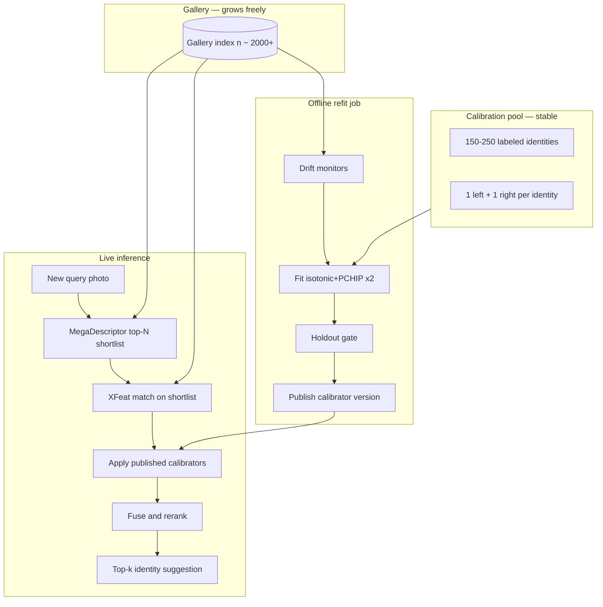

# Production calibrator refit plan

How to run **isotonic + PCHIP** calibration at scale (e.g. gallery \(n \approx 2000\) images) when enrolling new turtles — without retraining MegaDescriptor/XFeat or refitting on every new identity.

Related: [MD→XFeat calibration](md-xfeat-calibration.md) (research benchmark protocol) · Code: [`sides_matching/predictions.py`](../sides_matching/predictions.py), [`sides_matching/evaluation.py`](../sides_matching/evaluation.py)

## Goal

Deploy **A CalShortlist** (MD top-\(N\) → calibrate → fuse → rerank) in production where:

- The **gallery grows** as biologists add turtles and photos.
- **MegaDescriptor** and **XFeat** stay frozen (pretrained).
- Only the **calibrator** (score → hit-rate mapping) is refit — occasionally, offline.
- A **single new turtle** does not trigger a full retrain or mandatory refit.

## What is trained vs updated

| Component | Deep training? | On new turtle | On gallery drift |
|---|---|---|---|
| MegaDescriptor | Pretrained only | Extract features for new photos | No retrain |
| XFeat | Pretrained only | Extract features for new photos | No retrain |
| Isotonic + PCHIP (×2 streams) | Fast statistical fit | Usually **keep** existing calibrator | **Refit** when landscape shifts |
| LoRA (optional) | Fine-tune on train pools | No | Only if running a new LoRA training job |

**New turtle workflow:** add labeled photos → MD/XFeat feature extract → append to gallery index. No calibrator change required in the common case.

## Architecture overview



## Calibration pool (not the full gallery)

Do **not** refit using every enrolled turtle. Maintain a **fixed calibration pool**:

- **150–250 identities** (adjust with gallery size; see table below).
- **One left + one right** photo per identity (`split_calibration_one_per_side` in [`evaluation.py`](../sides_matching/evaluation.py)).
- Same **species, site, camera, preprocessing** as production (`flip=True` query protocol, sq512 XFeat, etc.).
- Reviewed **quarterly** — swap IDs only deliberately, not on every enrollment.

New production turtles go into the **search gallery**, not automatically into the calibrator fit set.

### Suggested sizes for \(n \approx 2000\) images

| Knob | Suggestion |
|---|---|
| Gallery images | ~2000 (scales up) |
| Calibration identities | 150–250 |
| Calibration queries | ~300–500 (1L + 1R each) |
| Holdout identities (deploy gate) | 30–50 (never used in fit) |
| Negative pair subsampling (if \(n > 3000\)) | Up to 1000 negatives per cal query |
| Refit cadence | Monthly + on drift alarm |
| Shortlist \(N\) | 10 (match benchmark unless tuned) |

If \(n\) means **2000 identities × ~4 photos ≈ 8000 images**, use **negative subsampling** during fit (below).

## When to refit

| Event | Refit? |
|---|---|
| 1 new turtle enrolled | **No** |
| Small growth (<5% gallery) | **No** (usually) |
| Bulk import (many IDs at once) | **Yes** |
| New camera, crop policy, or resize change | **Yes** |
| MD or XFeat model version change | **Yes** |
| Scheduled maintenance (e.g. monthly) | **Yes** (cal pool vs current gallery) |
| Drift monitor fires | **Yes** |

### Drift monitoring (cheap, daily)

Compare **current** score distributions to the snapshot taken at last calibrator publish:

- MD cosine: top-1, top-5, random pair histograms.
- XFeat: match-count histogram on MD shortlist pairs.

Trigger refit if, for example:

- Population stability index (PSI) > 0.1–0.2 on either stream, or
- Mean top-1 MD cosine shifts by more than a configured ε, or
- XFeat shortlist count median shifts materially.

Drift detects **score landscape change**, not “new ID appeared.”

## Refit job (offline)

Run as a **batch job**, never on the online match request path.

```text
1. Load calibration pool (fixed identity list + 1L+1R photo IDs).
2. Load holdout pool (30–50 identities, disjoint from cal pool).
3. Load current full gallery feature index.
4. For each cal query:
     a. MD cosine vs full gallery.
     b. XFeat match counts on MD top-N only.
5. Build (score, same_identity?) pairs:
     - Keep all positive pairs.
     - Subsample negatives if n_gallery is large (see below).
6. Fit IsotonicCalibration for MD stream.
7. Fit IsotonicCalibration for XFeat stream.
8. Evaluate on holdout queries (top-1 / top-5 vs previous calibrator).
9. If holdout OK → publish new version; else alert and keep old version.
```

### Pair collection cost

Fit uses pairs from **calibration query rows** only ([`_finite_pair_labels`](../sides_matching/predictions.py)):

\[
n_{\text{pairs}} \approx n_{\text{cal queries}} \times (n_{\text{gallery}} - 1)
\]

Example: 400 cal queries × 2000 gallery ≈ **800k pairs** per stream — sklearn isotonic is fine (seconds).

At 8000 gallery images, subsample **~1000 negatives per cal query** to cap ~400k pairs per stream.

### Negative subsampling (large galleries)

For each calibration query row:

1. Collect all **same-identity** pairs (positives) — keep all.
2. From **different-identity** pairs, sample up to `max_negatives` (e.g. 1000), stratified by score decile if possible.

Isotonic regression does not need every negative to learn the monotone mapping.

## Calibrator artifacts

Persist after each successful fit:

```text
calibrators/
  v2026-08-11/
    md_isotonic.pkl      # or wildlife_tools IsotonicCalibration state
    xfeat_isotonic.pkl
    metadata.json
```

`metadata.json` should include:

- `gallery_version` or content hash
- `fit_timestamp`
- `n_cal_identities`, `n_cal_queries`, `n_gallery`
- `shortlist_n`, `xfeat_resize`, `flip_query`
- Score summary stats (MD / XFeat histograms) for drift comparison
- Holdout metrics vs previous version

**Inference** loads the **published** version only. Refit produces a candidate; the holdout gate promotes it.

## Deploy gate (holdout)

Before swapping production calibrators:

1. Reserve **30–50 identities** in the calibration pool for holdout (never in fit).
2. Run MD→XFeat cal shortlist with **candidate** vs **current** calibrators on holdout queries.
3. Deploy candidate only if holdout top-1 is not worse than current (or improves by a small margin).

This mirrors the research split idea ([bilateral `one_per_side`](md-xfeat-calibration.md#calibration--test-split-one_per_side)) but applied to ops, not benchmark reporting.

## Online match path (per query)

```text
1. Extract MD + XFeat features for query (flip=True on query).
2. MD cosine vs full gallery → top-N candidate IDs.
3. XFeat match counts for those N pairs only.
4. cal_md = md_calibrator.predict(md_scores_on_shortlist)
5. cal_xfeat = xfeat_calibrator.predict(xfeat_scores_on_shortlist)
6. fused = 0.5 * (cal_md + cal_xfeat)
7. Rerank shortlist by fused (MD tie-break) → return top-k identities.
```

Calibrator `predict` is O(shortlist size) per query — negligible vs XFeat matching.

## What not to do

- **Do not** merge all research datasets (Reunion, Amvrakikos, Zakynthos) into one production calibrator unless production truly mixes those domains.
- **Do not** refit on every enrollment.
- **Do not** fit on unlabeled query logs.
- **Do not** run isotonic fit inside the synchronous API handler.
- **Do not** confuse benchmark `one_per_side` split (for accuracy reporting) with the **fixed calibration pool** (for ops) — same idea, different purpose.

## Mapping from research benchmark to production

| Research (`compare_md_xfeat_cal_shortlist.py`) | Production |
|---|---|
| Dataset loader (ReunionGreen, etc.) | One site/project gallery |
| `filter_bilateral_df` | Cal pool + gallery only include bilateral IDs (or exclude unilateral at enroll) |
| `split_calibration_one_per_side` | Fixed cal photo picks per cal-pool identity |
| Test queries → accuracy CSV | Holdout pool → deploy gate |
| `Combined(val_indices=...)` | Offline fit → saved calibrator artifacts |

## Implementation checklist (future code)

- [ ] `CalibratorStore` — save/load/version `IsotonicCalibration` bundles + metadata
- [ ] `collect_calibration_pairs(sim, identity, query_indices, max_negatives=...)`
- [ ] `fit_calibrators(pairs_md, pairs_xfeat) -> (cal_md, cal_xfeat)`
- [ ] `score_drift_report(current_stats, reference_stats) -> bool`
- [ ] Cron / workflow job: drift check → conditional refit → holdout gate → publish
- [ ] Inference service: load published version by `gallery_version` compatibility

## See also

- [MD→XFeat calibration](md-xfeat-calibration.md) — pipeline, isotonic+PCHIP, benchmark results
- [Base model comparison](base-model-comparison.md) — FusionCalibrated on research sets
- [`scripts/compare_md_xfeat_cal_shortlist.py`](../scripts/compare_md_xfeat_cal_shortlist.py) — reference rerank + eval script
